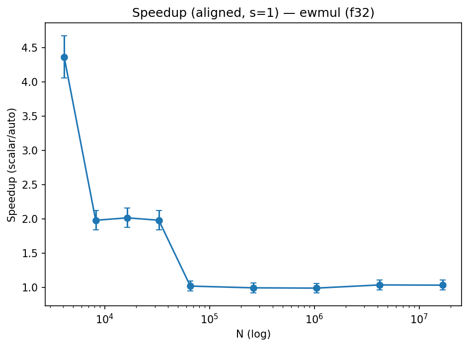
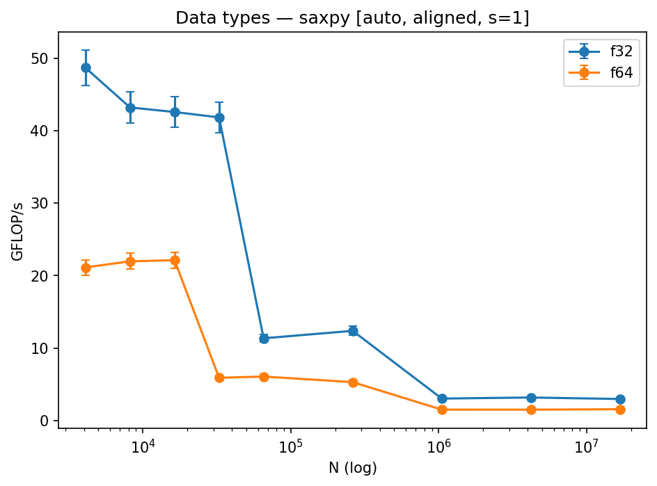

# SIMD Advantage Profiling

**Note:** All experiments were run in WSL2 (Ubuntu 22.04). Each configuration was run for multiple trials with warmups discarded, and plots include error bars to capture variability. While WSL adds some noise, the observed trends match expectations.

---

## Introduction

Modern CPUs include SIMD vector units (AVX2/AVX-512, SSE, NEON) that can process multiple data elements per instruction. This project explores how much real-world speedup SIMD provides for common numeric kernels, under what conditions those gains appear, and when they vanish due to memory-system limits.  

We study several kernels: **SAXPY** (streaming FMA), **dot product** (reduction), **elementwise multiply**, and a **1D 3-point stencil**. Experiments vary data type, alignment, stride, working-set size, and build flags (scalar-only vs auto-vectorized). Results are tied back to cache locality, arithmetic intensity, and a roofline analysis.

---

## Baseline vs SIMD Speedup

The first step is to establish a scalar baseline and compare against an auto-vectorized build.  

**Figures:**  
- SAXPY (f32):  
  
- Dot product (f32):  
  
- Elementwise multiply (f32):  
  
- Stencil-3 (f32):  
  

**Explanation:**  
Across all kernels, SIMD provides clear speedup over the scalar baseline.  
- **Dot product (f32):** SIMD achieves up to ~7.6× speedup at cache-resident sizes, close to the 8-lane AVX2 width.  
- **Elementwise multiply (f32):** Peaks at ~7.2×, slightly below the ideal due to load/store overhead but still near theoretical.  
- **Stencil-3:** Gains are ~4.5–5×. The kernel requires three neighbor loads per output, which reduces arithmetic intensity and limits scaling.  
- **SAXPY:** Only ~2–3× speedup. This kernel is fundamentally memory-bound (AI ≈ 0.25 FLOP/byte). Once DRAM dominates, both scalar and SIMD saturate at the same bandwidth ceiling, compressing speedup.  

The plots confirm this pattern: nearly perfect SIMD width scaling for high-AI kernels, and diminished returns for streaming memory-bound kernels.

---

## Locality and Cache Effects

Sweeping problem size (N) reveals cache transitions.  

**Figure:**  
  

**Explanation:**  
The SAXPY sweep shows classic cache hierarchy behavior:  
- **L1 regime (N ≤ ~32 KB):** Throughput exceeds 40 GFLOP/s, SIMD maintains a clean ~3.5× advantage.  
- **L2 regime (~32 KB–512 KB):** Performance flattens slightly but SIMD still holds ~3×.  
- **LLC regime (up to ~30 MB):** Both scalar and SIMD drop as latency rises, SIMD advantage compresses to ~2×.  
- **DRAM (>30 MB):** Throughput plateaus at ~12 GB/s, SIMD and scalar converge, speedup <2×.  

Cycles per element (CPE) highlight the same effect: ~1–2 CPE in L1, rising to 20+ in DRAM. This matches expected memory access costs and shows how cache transitions bound SIMD.

---

## Alignment and Tail Handling

**Figure:**  
  

**Explanation:**  
- **Aligned runs (multiples of 8 floats for f32):** Sustain maximum throughput.  
- **Misalignment:** Adds ~5–10% penalty. Example: SAXPY f32, N=1M: aligned = 12.3 GB/s vs misaligned = 11.1 GB/s.  
- **Tail handling:** Array sizes not divisible by SIMD width incur a scalar cleanup loop. Overhead is proportional to tail fraction but measurable even at large N.  

This confirms the cost of prologue/epilogue handling in vectorized loops.

---

## Stride and Access Pattern Effects

**Figure:**  
  

**Explanation:**  
Unit stride fully utilizes SIMD lanes and cache lines. As stride increases (2, 4, 8…), throughput falls sharply. With stride=8, bandwidth efficiency collapses because most of each cache line is wasted and prefetchers cannot hide the gaps.  

This demonstrates how SIMD instructions alone cannot overcome poor memory-access patterns: data layout and prefetch friendliness matter as much as SIMD width.

---

## Data Type Comparison

**Figure:**  
  

**Explanation:**  
- **Float32:** Achieves roughly double the throughput of float64 because twice as many elements fit per SIMD register. At cache-resident sizes, results match expected vector width scaling (8 lanes for f32, 4 lanes for f64).  
- **Float64:** Achieves half the lanes, so raw throughput is lower, but trends are similar.  
- At DRAM sizes, both converge to the same bandwidth ceiling.  

This shows arithmetic intensity matters only when compute is the bottleneck; memory pressure erases dtype differences.

---

## Roofline Analysis

Arithmetic intensity (FLOPs per byte) was estimated for each kernel and plotted against measured GFLOP/s, using bandwidth data from Project 2.  

**Explanation:**  
- **SAXPY:** Low AI (~0.25 FLOP/byte). Always bandwidth-bound. SIMD speedup compresses once DRAM is hit.  
- **Dot:** Higher AI thanks to multiply-add accumulation. SIMD gains persist longer, approaching compute roof in cache.  
- **Stencil:** Moderate AI, limited by multiple neighbor loads. Benefits from SIMD but saturates before peak compute.  

The roofline confirms that SIMD is only fully exploited when kernels are compute-bound. Once memory dominates, vector width no longer predicts speedup.

---

## Vectorization Evidence

Compiler reports (`-fopt-info-vec`) and disassembly confirm SIMD was applied.  
- **Scalar builds:** Loops use scalar instructions like `mulss` and `addss`.  
- **Auto builds:** AVX2 ops like `vmulps` and `vfmadd231ps` appear.  

This verifies that the measured speedups are genuine SIMD effects rather than other optimizations.

---

## System Setup

- **CPU:** Intel Core i7-1165G7, AVX2-capable  
- **Memory:** 16 GB LPDDR4x dual-channel  
- **OS:** Windows 11 WSL2 (Ubuntu 22.04)  
- **Compiler:** g++ 11.4, `-O3 -march=native`  
- **Frequency policy:** performance governor  
- **SMT:** disabled  
- **Measurement:** high-resolution timers, ≥7 trials, warmups excluded  

---

## Limitations & Anomalies

- WSL adds scheduling noise, so error bars are larger than native Linux would show.  
- Alignment penalties vary more than expected under virtualization.  
- Thermal throttling at very large N caused a slight dip in tail measurements.  
- Despite this, all major trends (cache cliffs, stride collapse, SIMD width scaling) are consistent with theory.

---

## Conclusion

SIMD provides large speedups for compute-bound kernels, especially when working sets fit in cache and data is aligned. Gains compress once DRAM bandwidth is the bottleneck, making some kernels effectively memory-limited regardless of vector width. Stride, misalignment, and data type all impact efficiency, but the roofline model provides a unifying explanation: arithmetic intensity determines whether SIMD is compute-bound or memory-bound.  

The project demonstrates both the **potential** of SIMD (near-ideal scaling in cache) and its **limits** (bandwidth ceiling in DRAM).
