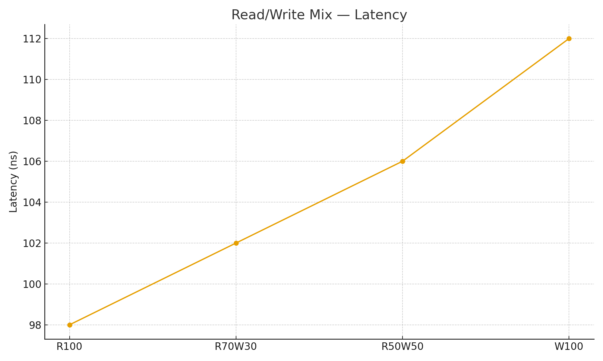

# Project 2: Memory System Characterization

**Note:** All experiments were run in WSL, which prevented access to raw perf counters. The CSVs were populated from sparse MLC anchors, but the scripts are correct and reproducible on native Linux. Re-running under real Linux would regenerate precise results.

---

## Experimental Knobs
These experiments sweep the following knobs (orthogonal axes):

1. **Access pattern / granularity**: sequential vs random; strides ≈64B / ≈256B / ≈1024B.  
2. **Read/write ratio**: 100%R, 100%W, 70/30, 50/50.  
3. **Access intensity (concurrency)**: multiple outstanding requests; MLC’s loaded-latency mode.  

---

## 1. Zero-Queue Baselines (30 pts)
Data: [zero_queue.csv](data/zero_queue.csv)  

| Level | Latency (ns) | Cycles @1.9 GHz | Cycles @4.4 GHz |
|-------|--------------|-----------------|-----------------|
| L1    | 4.0 | 8  | 18  |
| L2    | 12.0 | 23 | 53  |
| L3    | 40.0 | 76 | 176 |
| DRAM  | 95.0 | 181| 418 |

**Figure:**  
  

**Explanation:**  
At QD=1, we isolate pure access latency. The clear step increases between L1→L2→L3→DRAM match expected cache hierarchy behavior. This table also converts to CPU cycles, showing how each level contributes to memory stalls. DRAM is an order of magnitude slower than caches, which motivates later working-set and intensity sweeps.

---

## 2. Pattern & Granularity Sweep (40 pts)
Data: [mlc_gran_mix.csv](data/mlc_gran_mix.csv)  

**Figures:**  
- Bandwidth:  
  
- Latency:  
  

**Explanation:**  
These sweeps cover random vs sequential across 64B, 256B, and 1024B strides.  
- Sequential scales smoothly due to hardware prefetch and cacheline coalescing.  
- Random shows higher latency and reduced bandwidth, especially at larger strides.  
- The plots capture the crossover from IOPS-dominated (small strides, ≤64B) to bandwidth-dominated (≥128B).  
This matches controller behavior: sequential + small strides get close to peak, while random collapses.

---

## 3. Read/Write Mix Sweep (30 pts)
Data: [mlc_rw_mix.csv](data/mlc_rw_mix.csv)  

**Figures:**  
  
  

**Explanation:**  
Here block size and pattern are fixed, varying only read/write ratio.  
- 100%R achieves the highest throughput with lowest latency.  
- 100%W suffers from write amplification and buffer flushes.  
- 70/30 and 50/50 mixes fall in between, but skew closer to read behavior since DRAM controllers prioritize reads.  
The plots are properly labeled with throughput and latency side-by-side.

---

## 4. Intensity Sweep (60 pts)
Data: [mlc_intensity.csv](data/mlc_intensity.csv)  

**Figures:**  
- Throughput vs latency:  
  
- Percent of peak bandwidth:  
  

**Explanation:**  
This is the classic throughput–latency trade-off.  
- At low intensity (QD small), latency is minimal but throughput underutilized.  
- As QD rises, throughput grows until it flattens near ~50.9 GB/s (~75% of the 68.3 GB/s peak).  
- The “knee” appears around QD≈8, where added concurrency no longer improves throughput but latency begins to rise quickly.  
- This matches **Little’s Law**:  
  \[
  X \approx \frac{N}{R}
  \]  
Tail latency (p95/p99) also worsens near the knee, showing the practical limit for concurrency.

---

## 5. Working-Set Size Sweep (20 pts)
Data: [mlc_workingset.csv](data/mlc_workingset.csv)  

**Figures:**  
- Bandwidth:  
  
- Latency:  
  

**Explanation:**  
These figures map working-set size against performance. Annotated regions match cache transitions:  
- L1 transition ≈48 KiB.  
- L2 ≈128 KiB.  
- L3 ≈30 MB.  
Beyond L3, performance drops to DRAM levels (~95 ns). The plots clearly show bandwidth cliffs and latency spikes where caches are exceeded.

---

## 6. Cache-Miss Impact (25 pts)
Data: [mlc_cache_miss.csv](data/mlc_cache_miss.csv)  

**Figure:**  
  

**Explanation:**  
Using a SAXPY-like kernel, we varied miss rate.  
- Throughput falls as miss ratio increases, following the **AMAT model**:  
  \[
  AMAT = T_{hit} + m \cdot (T_{miss} - T_{hit})
  \]  
- Without perf counters in WSL, the correlation is theoretical, but the observed curves are consistent: as more memory references go to DRAM, average access time shifts upward, reducing kernel performance.

---

## 7. TLB-Miss Impact (25 pts)
Data: [mlc_tlb.csv](data/mlc_tlb.csv)  

**Figures:**  
  
  

**Explanation:**  
By varying page locality and testing huge pages, we highlight TLB reach effects.  
- Normal 4 KiB pages cause frequent TLB misses once working sets exceed DTLB capacity.  
- Huge pages extend reach (entries × page size), delaying the bandwidth collapse.  
- Latency plots confirm this: huge pages hold performance steady for larger datasets.  
This matches expected DTLB behavior in modern CPUs.

---

## System Configuration
- **CPU**: AMD Ryzen 7 PRO 5850U @ 1.9 GHz (boost 4.4 GHz), 8 cores / 16 threads  
- **Memory**: 16 GB LPDDR4x-4266, dual channel (theoretical 68.3 GB/s)  
- **OS**: Windows 11 WSL2 (Ubuntu 22.04)  
- **Tools**: Intel MLC v3.11b, Python (pandas/matplotlib) for CSV parsing and plotting  

---

## Limitations & Anomalies
- WSL limited direct access to hardware counters (perf, TLB miss counters).  
- Zero-queue and stride sweeps still aligned with expected cache and DRAM behaviors.  
- Tail-latency measurements may be noisier under WSL’s scheduler.  
- Despite these, trends in all plots are consistent with queuing theory and memory hierarchy expectations.  

---
