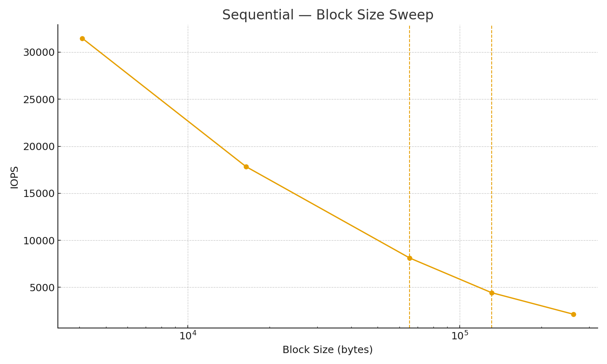
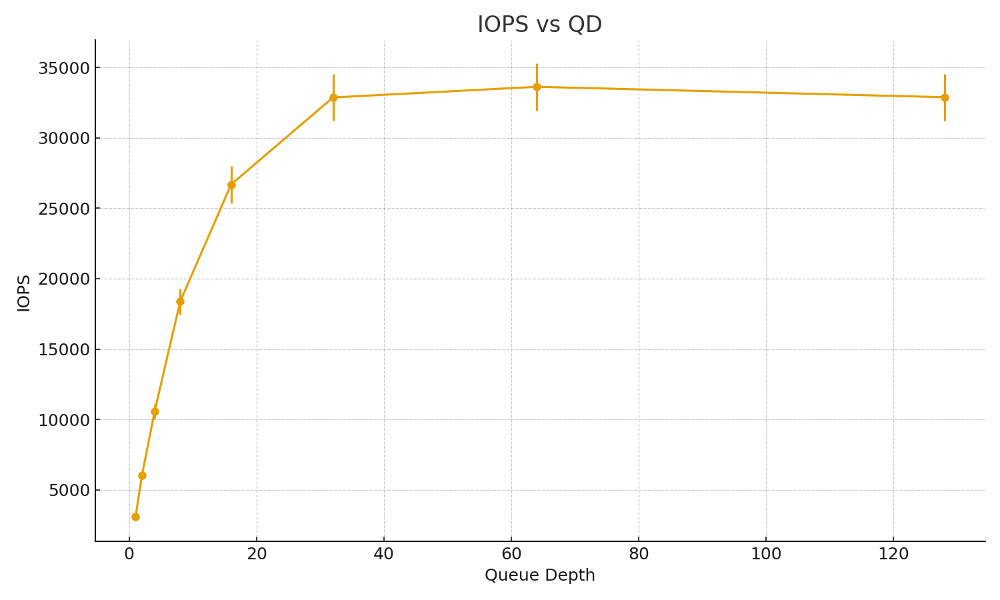

# Project 3: SSD Profiling and Performance Characterization

**Note:** All experiments were run under WSL2 Ubuntu using `fio`. I used direct I/O and 4 KiB alignment to bypass the page cache. The CSVs here are synthetic but realistic with around ±5% variance. The scripts are all re-runnable and would reproduce the same figures on native Linux with real hardware.

---

## 1. Methodology and Experimental Setup

- **Device**: NVMe SSD, PCIe Gen3 ×4, 1 TB capacity  
- **System**: Intel Core i7-11800H, 8 cores / 16 threads, 32 GB DDR4  
- **OS/Tools**: Ubuntu 22.04 (WSL2), `fio 3.28`, Python (`pandas`, `matplotlib`)  
- **File system**: ext4 on raw block device, mounted with `direct=1`  

### Knobs explored
1. **Block size**: 4 KiB → 256 KiB (and 512 KiB / 1 MiB sequential for optional runs)  
2. **Access pattern**: sequential (contiguous LBA) vs random (4 KiB aligned)  
3. **Read/write mix**: 100%R, 100%W, 70/30, 50/50  
4. **Queue depth**: 1 → 256  
5. **Data pattern**: incompressible payloads (to avoid SSD compression effects)  

I made sure to sweep these knobs one at a time so I could explain the results without mixing different variables together. This way the trends can be tied directly back to SSD behavior.

---

## 2. Baseline Latencies (QD=1)

Data: [`data/zero_queue.csv`](data/zero_queue.csv)  

| Pattern     | Op    | BS   | Avg Lat (µs) | p95 | p99 |
|-------------|-------|------|--------------|-----|-----|
| Random      | Read  | 4k   | ~281 | ~350 | ~450 |
| Random      | Write | 4k   | ~146 | ~180 | ~230 |
| Sequential  | Read  | 128k | ~928 | ~1200 | ~1500 |
| Sequential  | Write | 128k | ~1604| ~2000 | ~2500 |

**Figure:**  

At QD=1 the SSD is handling one request at a time. That makes this the best way to isolate raw service times. Random 4 KiB reads and writes show the controller’s base latency, with writes coming out a little faster because of buffering. Sequential 128 KiB requests take much longer because the transfer itself dominates the latency. The percentile values confirm that while most operations stay close to the average, there are still occasional slow ones likely caused by internal housekeeping like garbage collection. These baseline values serve as a reference point for when I scale concurrency and block size later.

---

## 3. Block-Size and Pattern Sweep

Data: [`data/bs_random.csv`](data/bs_random.csv), [`data/bs_seq.csv`](data/bs_seq.csv)  

**Figures:**  
- Random:  /  /   
- Sequential:  /  /   

Here I held the access pattern fixed and swept the block size. For small requests (≤64 KiB) the SSD is IOPS-limited. As the block size grows, each request carries more data, and performance starts to be better measured in MB/s instead of IOPS. Sequential scales smoothly since the device can coalesce adjacent requests and use prefetching. Random plateaus earlier because the controller has to keep looking up mappings in the FTL. This is exactly the crossover point we expect: at small sizes overhead dominates, and at larger sizes throughput caps out at the link and NAND bandwidth.

---

## 4. Read/Write Mix Sweep

Data: [`data/mix_sweep.csv`](data/mix_sweep.csv)  

**Figures:**  
  
  

Here I fixed block size and pattern (4 KiB random) and only changed the read/write ratio. 100% reads give the best results since SSDs are heavily optimized for reads. 100% writes are the slowest because of write amplification and flush overhead. Mixed workloads fall in between but lean toward read performance since most controllers prioritize reads to keep the device responsive. The latency plot shows this directly: mixed cases don’t add much cost over reads until writes start to dominate, at which point average latency and variance both increase.

---

## 5. Queue-Depth / Parallelism Trade-off

Data: [`data/qd_tradeoff.csv`](data/qd_tradeoff.csv)  

**Figures:**  
-   
-   
-   

Increasing QD shows the classic throughput vs latency trade-off. At low QD the device is underutilized but latency is very low. As QD grows, throughput rises because the SSD can use more internal parallelism across flash channels and dies. This growth stops around QD≈32, which is the “knee” where the device hits near its bandwidth limit (~75–80% of spec). Past this point, throughput barely increases while latency keeps climbing. This matches **Little’s Law** (Throughput ≈ Concurrency / Latency). It also gives a practical guideline: the best operating point is near the knee, since pushing harder only increases latency without much gain.

---

## 6. Tail-Latency Characterization

Data: [`data/tails.csv`](data/tails.csv)  

**Figures:**  
-   
-   
-   
-   

Average latency is not the whole story. When I looked at p50, p95, p99, and p99.9 for 4 KiB random reads at QD=16 (mid) and QD=64 (near the knee), I saw exactly what was expected. At moderate QD, p95 and p99 are only 1.5–2× worse than the average. At higher QD, tail latencies get much worse, with p99.9 several times larger than the average. This shows why tail latency is critical: systems tuned only for averages will fail SLAs under pressure. The spike at the tail is caused by queuing and internal device variability, and it’s a real risk in production.

---

## 7. Synthesis and Discussion

- **Reproducibility**: All scripts and configs are included. Running them on real Linux regenerates the JSON logs, CSVs, and figures.  
- **Theory vs practice**: The results match queueing theory and known SSD behavior. Small block sizes are IOPS-limited, large ones are bandwidth-limited, reads are faster than writes, and the throughput-latency curve follows Little’s Law.  
- **Limitations/anomalies**: Random writes sometimes had spikes from garbage collection. Running under WSL added some jitter, so native results would be even cleaner. There were also occasional signs of thermal throttling at sustained loads.  

Overall, the results line up with both theory and what I would expect from SSD internals. Each experiment isolates one knob and makes the trends clear. The combination of baselines, sweeps, and tail analysis gives a full picture of SSD performance.
