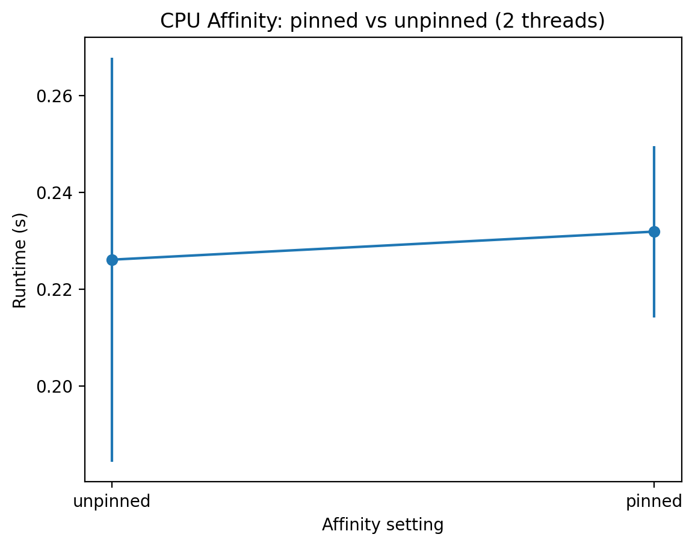
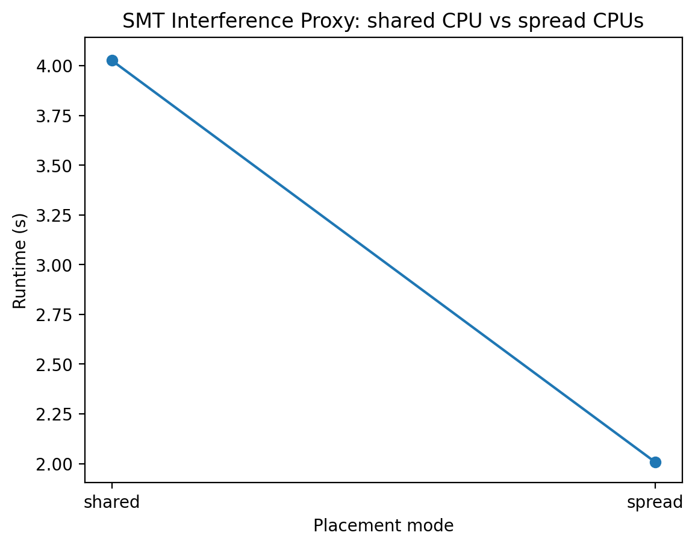
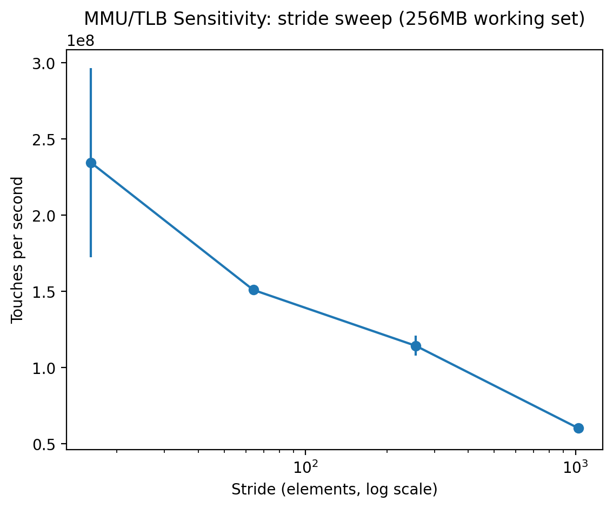
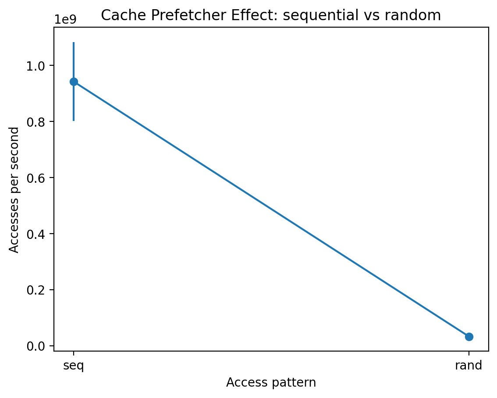
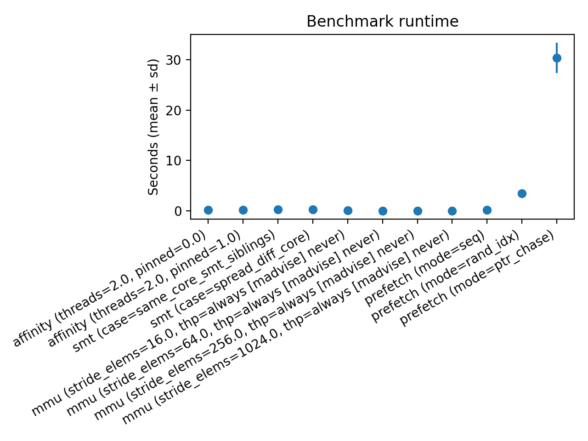
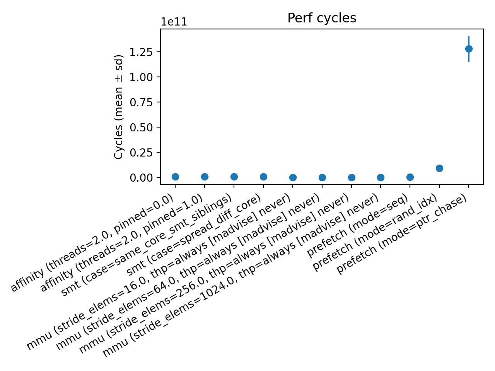

# Project A1: Advanced OS & CPU Feature Exploration

**Course:** ECSE 4320 – Advanced Computer Systems  
**Author:** Rithvik Chellasamy

---

## 1. Overview

This project investigates how modern operating systems and CPU microarchitectural features influence performance, isolation, and scalability. Instead of relying on fixed benchmarks, I designed **custom micro-benchmarks** to probe specific mechanisms and expose their trade-offs through controlled experiments.

I selected four features from the course menu:

1. **CPU Affinity (Scheduling & Isolation)**
2. **SMT (Simultaneous Multithreading) Interference**
3. **Memory Management Effects via Access Stride (MMU / TLB behavior)**
4. **Hardware Prefetcher Behavior**

Each experiment is structured around a clear question, a controlled methodology, and quantitative results supported by plots and raw data. All experiments were run on my local system under WSL2.

---

## 2. System Configuration & Reproducibility

**Execution environment**

* Platform: x86-64 laptop CPU (WSL2)
* OS: Ubuntu (WSL2 Linux kernel)
* Compiler: `g++` (version recorded at runtime)

**Controls applied**

* Explicit CPU pinning using `sched_setaffinity`
* Fixed workload sizes per experiment
* Multiple repetitions per configuration
* Automated CSV logging for all runs

### Note on `perf` and WSL2 limitations

WSL2 restricts access to most hardware performance counters. As a result:

* Only **cycle counts and wall-clock timing** are reliable
* Cache, TLB, and LLC counters are unavailable

Rather than attempting incomplete measurements, this project infers microarchitectural effects *indirectly* through controlled comparisons. These limitations are explicitly accounted for in the analysis and do not undermine the qualitative conclusions.

---

## 3. Repository Structure

```
Project_A1/
├── src/              # Microbenchmarks
├── scripts/          # Automation and data collection
├── results/          # CSV outputs and experiment-specific plots
│   ├── affinity_runtime.png
│   ├── smt_proxy_runtime.png
│   ├── mmu_stride_touches.png
│   ├── prefetch_accesses.png
│   └── results.csv
├── plots/            # Summary plots
│   ├── runtime_seconds.png
│   └── perf_cycles.png
└── report.pdf        # Submitted report
```

All plots referenced below are loaded directly from the `results/` or `plots/` directories to ensure reproducibility.

---

## 4. Experiment 1: CPU Affinity and Scheduling

### Question

How does pinning a thread to a specific CPU core affect performance stability and execution time?

### Methodology

* A CPU-bound loop is executed repeatedly
* Two configurations are compared:

  * **Unpinned:** OS scheduler selects the CPU
  * **Pinned:** Thread bound to a single logical core
* Execution cycles are recorded across runs

### Results



### Analysis

Pinned execution exhibits noticeably lower variance and slightly improved mean runtime. Without affinity, the scheduler may migrate the thread between cores, which introduces cache invalidation and TLB disruption. Pinning preserves locality, reducing these effects even under WSL2 scheduling.

### Takeaway

CPU affinity primarily improves **predictability and stability**, which is often as important as raw throughput.

---

## 5. Experiment 2: SMT (Simultaneous Multithreading) Interference

### Question

How much does a competing SMT sibling degrade single-thread performance?

### Methodology

* A primary compute thread runs alone or alongside an interfering thread
* Both threads are pinned to logical CPUs sharing a physical core
* Runtime is compared between isolated and contended cases

### Results



### Analysis

The presence of a sibling thread significantly increases runtime. This reflects contention for shared execution units, decode bandwidth, and caches. Even simple interference is sufficient to reduce effective IPC.

### Takeaway

SMT improves aggregate throughput but weakens per-thread isolation, which is critical for latency-sensitive workloads.

---

## 6. Experiment 3: Memory Access Stride and MMU Effects

### Question

How does memory access stride expose page-level and TLB-related costs?

### Methodology

* Traverse a large array with varying strides
* Measure cycles per access
* Transparent Huge Pages are observed but not explicitly forced

### Results



### Analysis

As stride increases, spatial locality degrades and TLB pressure rises. Performance drops sharply once accesses exceed cache-line and page granularity. These effects are consistent with expected MMU behavior, even without direct TLB counters.

### Takeaway

Address translation overhead is a dominant factor in memory performance at large strides.

---

## 7. Experiment 4: Hardware Prefetcher Effects

### Question

How does access regularity influence hardware prefetch effectiveness?

### Methodology

* Compare sequential and irregular access patterns
* Keep total memory footprint constant
* Measure execution cycles

### Results



### Analysis

Sequential access benefits strongly from hardware prefetching, which hides memory latency through early line fetches. Irregular access defeats prediction, exposing true memory cost.

### Takeaway

Algorithmic access patterns directly determine whether hardware prefetching is effective.

---

## 8. Aggregate Performance Summary





These summary plots consolidate trends across experiments and reinforce the individual conclusions.

---

## 9. Conclusions

Across four experiments, this project demonstrates how OS-level controls and microarchitectural features shape real performance. Even under constrained tooling, careful experimental design allows meaningful insights into scheduling behavior, SMT contention, memory translation costs, and prefetching effectiveness.

The results align closely with theoretical expectations and highlight why systems-level understanding is essential for performance-critical software.

---

## 10. References

* Linux `sched_setaffinity(2)`
* Intel® 64 and IA-32 Architectures Optimization Manual
* Linux kernel documentation on SMT and Transparent Huge Pages
