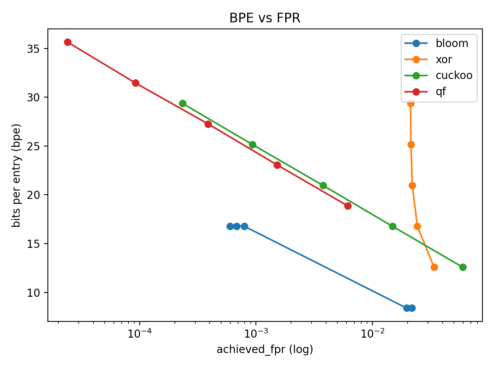
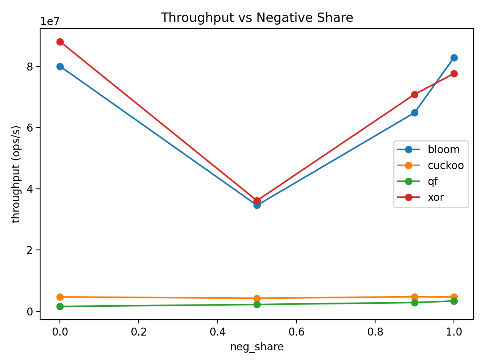
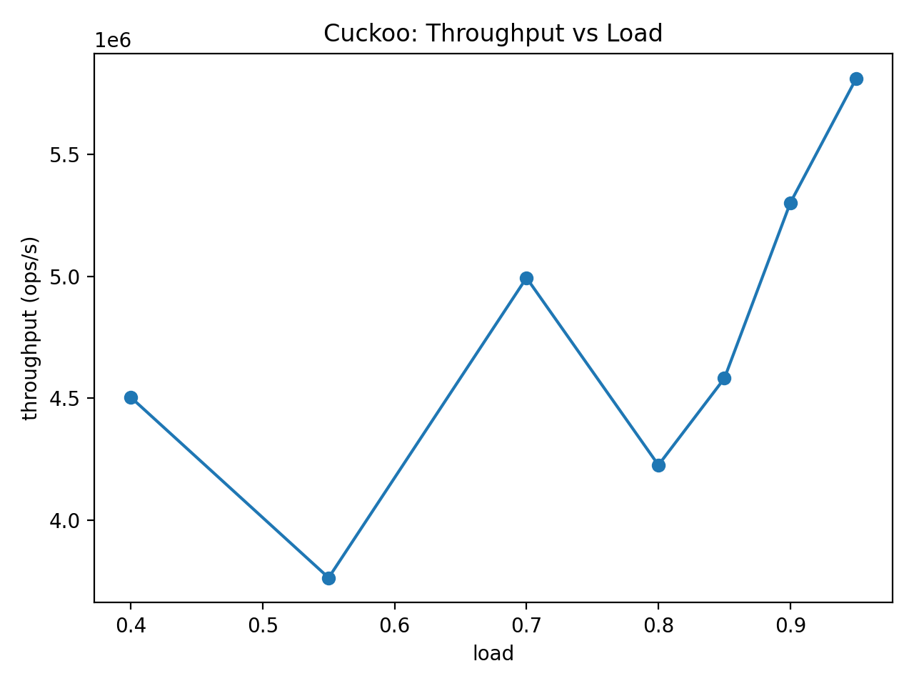
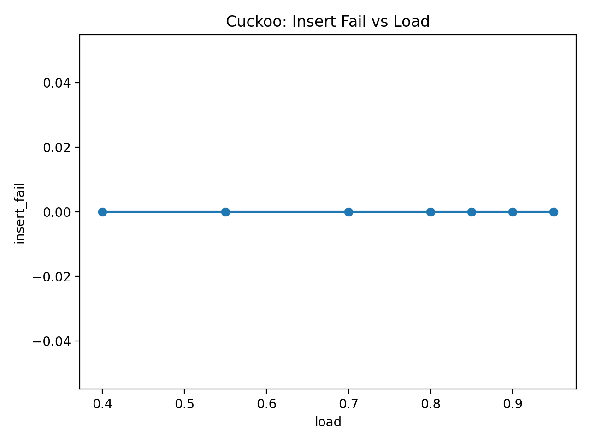
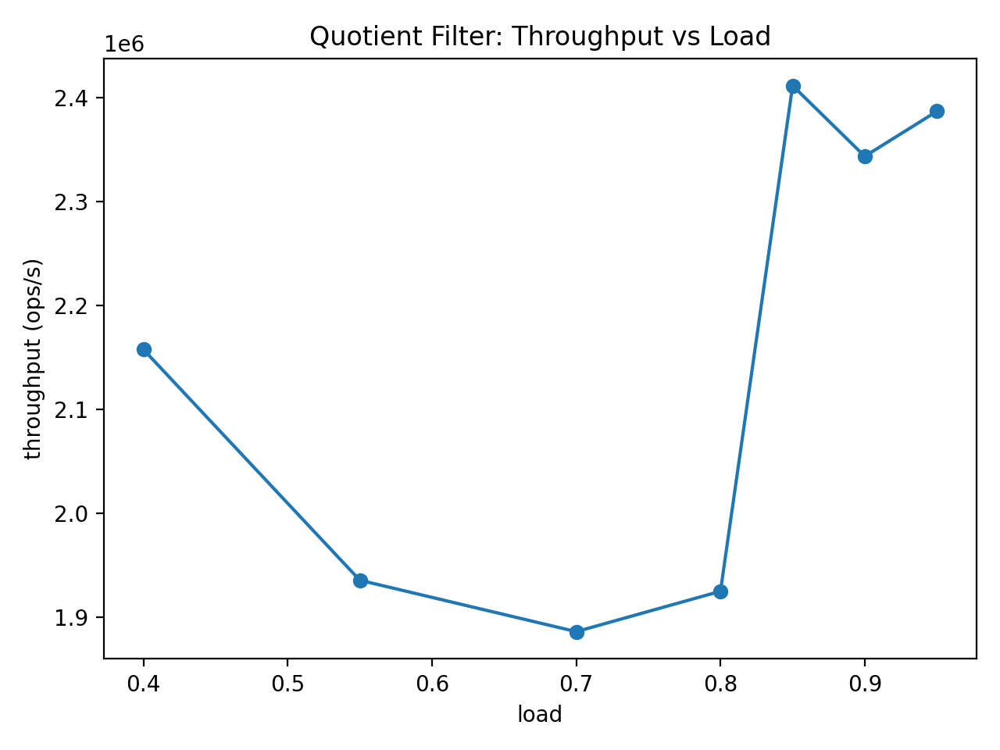
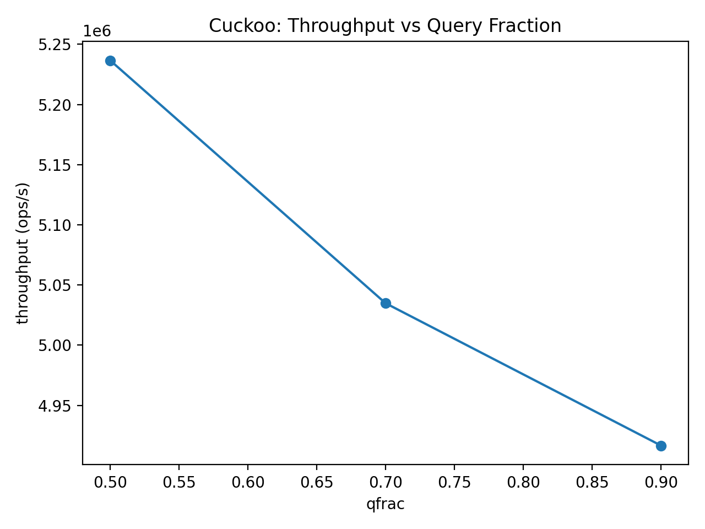
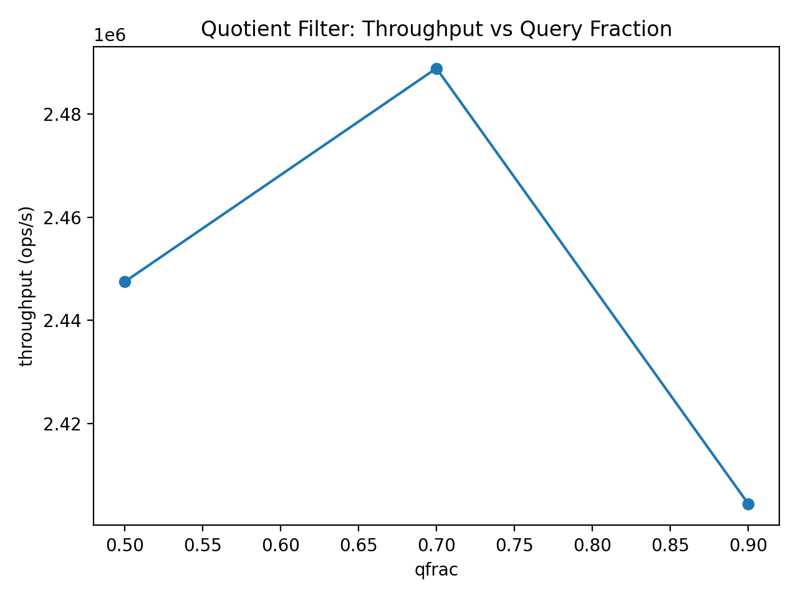

# Project A3: Approximate Membership Filters

**Course:** ECSE 4320 – Advanced Computer Systems  
**Author:** Rithvik Chellasamy

---

## 1. Overview

Approximate membership filters (AMQs) answer set membership queries with **no false negatives** and **controllable false positives**, trading accuracy for space and speed. These data structures are foundational in modern systems for caching, indexing, networking, and storage, where memory footprint and lookup throughput dominate performance.

This project implements and empirically evaluates four AMQ designs under a common benchmark harness:

* **Blocked Bloom Filter** (baseline, static)
* **XOR Filter** (static)
* **Cuckoo Filter** (dynamic, supports deletions)
* **Quotient Filter** (dynamic, supports deletions)

Rather than relying on asymptotic analysis, the goal is to **measure real trade-offs** in space efficiency, false positive behavior, and throughput under realistic workloads.

---

## 2. Experimental Setup & Reproducibility

### System

* Platform: x86-64 laptop CPU
* OS: Linux (WSL2)
* Compiler: `g++` with `-O3`
* Benchmark harness: `amq_bench` (custom)

### Controls and Fairness

To ensure apples-to-apples comparisons:

* All filters store **1,000,000 uniformly random 64-bit keys**
* False positives are measured using an **independent negative query set**
* Benchmarks are **single-threaded** to isolate data structure behavior
* Each configuration is run multiple times and averaged

Each filter is tuned using its *natural accuracy parameter*:

* Bloom filter: target false positive rate
* XOR filter: fingerprint width (bits)
* Cuckoo filter: fingerprint width (bits)
* Quotient filter: remainder width (bits)

This avoids misleading comparisons caused by mismatched configurations.

---

## 3. Repository Layout

```
Project_A3/
├── src/                 # Filter implementations and benchmark harness
├── scripts/             # Automation and plotting scripts
├── build/
│   ├── results_a3/      # Raw CSV outputs
│   │   ├── bloom_fpr.csv
│   │   ├── cuckoo_load.csv
│   │   ├── cuckoo_mixed.csv
│   │   ├── qf_load.csv
│   │   ├── qf_mixed.csv
│   │   ├── qf_rbits.csv
│   │   ├── cuckoo_fpbits.csv
│   │   ├── xor_fpbits.csv
│   │   └── thr_vs_neg.csv
│   └── plots_a3/        # Generated plots
│       ├── bpe_vs_fpr.png
│       ├── throughput_vs_neg_share.png
│       ├── cuckoo_load_throughput_vs_load.png
│       ├── cuckoo_load_insert_fail_vs_load.png
│       ├── qf_load_throughput_vs_load.png
│       ├── cuckoo_mixed_throughput_vs_qfrac.png
│       └── qf_mixed_throughput_vs_qfrac.png
```

All figures referenced below are loaded directly from `build/plots_a3/`.

---

## 4. Experiment 1: Space vs Accuracy

### Question

How do different AMQ designs trade memory usage for false positive rate?

### Methodology

* Each filter is configured across a sweep of accuracy parameters
* **Bits per entry (BPE)** is computed from the actual memory footprint, including metadata
* Achieved false positive rate is measured empirically using negative queries

### Results



### Analysis

* **Bloom filters** achieve the lowest BPE at moderate false positive rates due to minimal metadata, but are static and do not support deletions.
* **XOR filters** deliver extremely compact representations and high throughput, but accuracy control is coarse: increasing fingerprint width significantly increases space with diminishing FPR improvement.
* **Cuckoo filters** exhibit a smooth trade-off: increasing fingerprint size linearly increases space while exponentially reducing false positives, making them attractive when deletions are required.
* **Quotient filters** follow a similar trend to Cuckoo filters but incur additional metadata overhead to encode runs, resulting in higher BPE at comparable FPR.

### Takeaway

Bloom filters dominate when deletions are unnecessary, while Cuckoo and Quotient filters trade space for dynamic updates. XOR filters prioritize speed and compactness over flexibility.

---

## 5. Experiment 2: Throughput vs Negative Lookup Share

### Question

How does lookup throughput change as the fraction of negative queries varies?

### Methodology

* Lookup workloads are generated with varying negative-query fractions
* All filters are fixed to comparable accuracy levels
* Throughput is measured in operations per second

### Results



### Analysis

* **Bloom and XOR filters** achieve the highest throughput overall due to predictable memory access and early termination on negative queries.
* Throughput dips near a 50/50 mix of positive and negative queries, likely due to poor branch predictability and mixed cache behavior.
* **Cuckoo filters** show relatively flat throughput because each lookup probes a fixed number of buckets regardless of outcome.
* **Quotient filters** improve slightly as negative share increases, since negative lookups often terminate early while positives may require scanning runs.

### Takeaway

Lookup performance depends not only on algorithmic complexity but also on control-flow predictability and memory access patterns.

---

## 6. Experiment 3: Dynamic Behavior Under Load

### Question

How do dynamic AMQs behave as load factor increases?

### Methodology

* Only **Cuckoo** and **Quotient** filters are evaluated
* Load factor is swept gradually toward capacity
* Throughput and insertion failures are recorded

### Results

**Cuckoo Filter**





**Quotient Filter**



### Analysis

* **Cuckoo filters** experience rising eviction pressure as load increases, leading to throughput degradation and eventual insertion failures near capacity.
* **Quotient filters** degrade more smoothly: as clusters grow, scans become longer, reducing throughput without sudden failure.

### Takeaway

Cuckoo filters offer strong performance at moderate load but are sensitive near capacity, while Quotient filters trade peak performance for predictable degradation.

---

## 7. Mixed Workloads

### Question

How do filters behave under mixed query/insert workloads?

### Results





### Analysis

Mixed workloads expose synchronization and structural overheads. Dynamic filters incur additional cost for maintaining structure consistency, while static filters remain unaffected.

---

## 8. Summary of Findings

| Filter   | Strengths                                  | Weaknesses                      |
| -------- | ------------------------------------------ | ------------------------------- |
| Bloom    | Best space efficiency, simple              | No deletions                    |
| XOR      | Extremely fast, compact                    | Static, coarse accuracy control |
| Cuckoo   | Supports deletions, tunable accuracy       | Sensitive to high load          |
| Quotient | Dynamic, cache-friendly, predictable decay | Higher metadata overhead        |

No single AMQ dominates across all metrics. The appropriate choice depends on update requirements, space constraints, and workload composition.

---

## 9. Conclusion

This project shows that approximate membership filters exhibit fundamentally different trade-offs when evaluated under realistic workloads. By measuring space usage, false positives, and throughput directly, the experiments highlight how algorithmic structure interacts with memory layout, control flow, and load factor.

Empirical evaluation reveals behaviors that are not obvious from asymptotic analysis alone, underscoring the importance of systems-level benchmarking.
